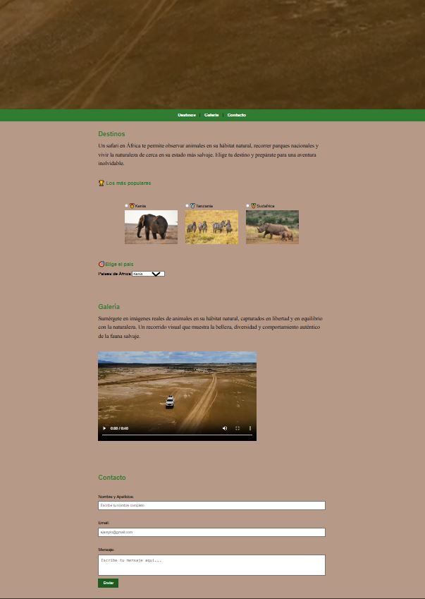

# 🌍 Página Web: Safari en África

[Safari en África](https://silbertvb.github.io/Pagina-Web-Safari-en-frica-/)
Consiste en una landing page temática sobre un **Gestor de viajes en países de África**, con navegación por secciones, contenido multimedia y enfoque en la **optimización de vídeo**.

---

## 🖼️ Vista previa



---

## ✨ Características principales

- 🎥 **Vídeo fijo en la cabecera** (hero) con reproducción automática e infinita (loop)
- 🧭 **Barra de navegación** que permite moverse entre secciones
- 🐘 Sección **Destinos**
  - listado de destinos populares (Kenia, Tanzania, Sudáfrica)
  - **desplegable** para elegir país
- 🎬 Sección **Galería**
  - vídeo optimizado con música de fondo
  - proceso de edición y renderizado con herramientas externas
- ✉️ Sección **Contacto**
  - formulario con `textarea`
- 🧾 Footer final

---

## 🧰 Tecnologías utilizadas

- **HTML5**
- **CSS3**
- **JavaScript**
- Multimedia:
  - vídeos en formato `.mp4`
  - imágenes `.jpg`

---

## 🗂️ Estructura del proyecto

```bash
.
├── index.html
├── styles.css
├── script.js
├── img/
│   ├── Kenia_elefante.jpg
│   ├── Tanzania_zebras.jpg
│   └── Sudafrica_rinho.jpg
└── video/
    ├── AdobeExpress_Montaje2.mp4
    └── DaVincciResolve_Montaje1.mp4
